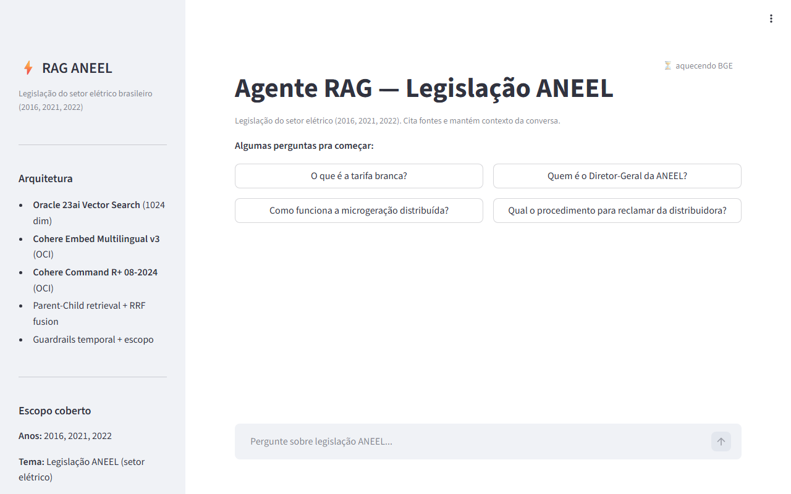
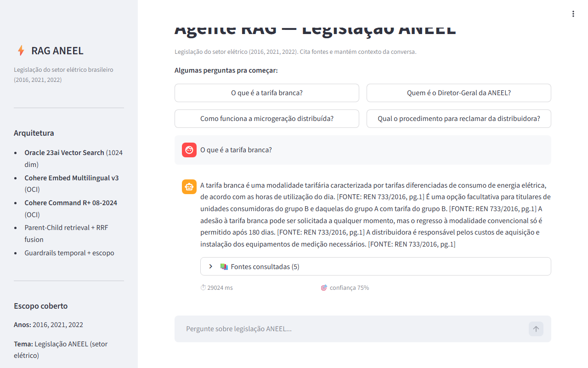
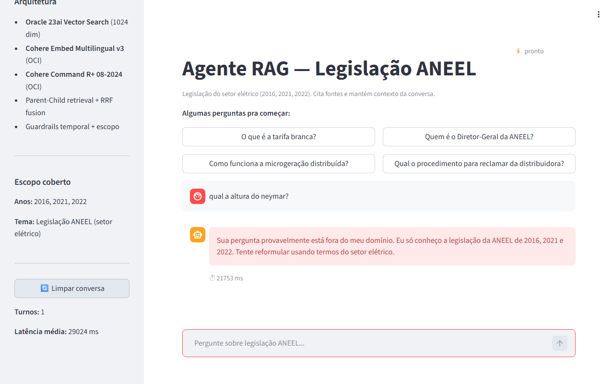
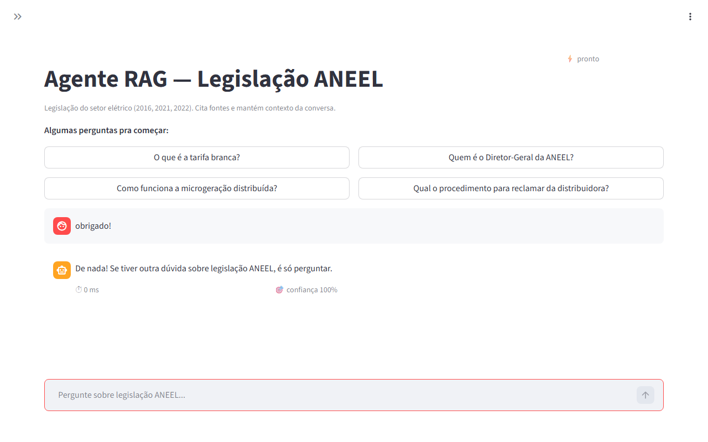
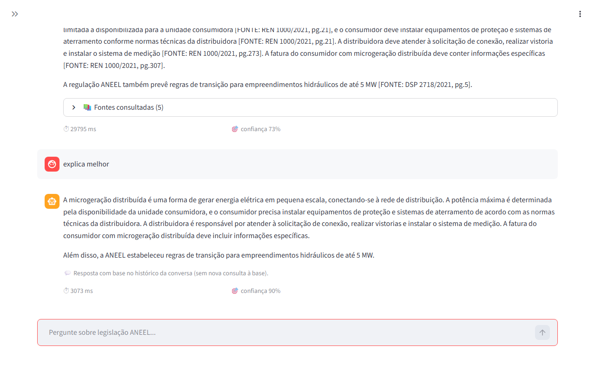
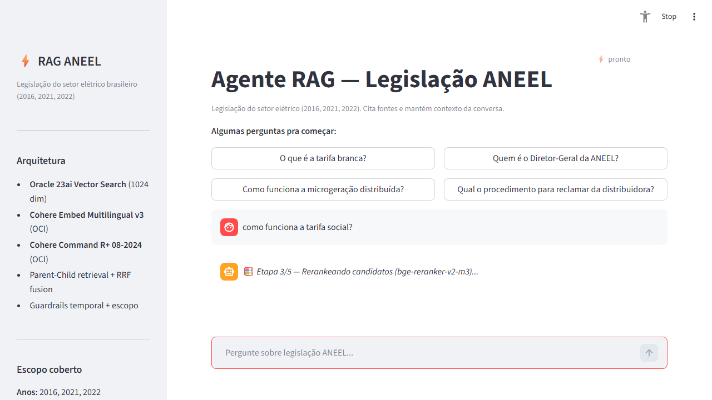
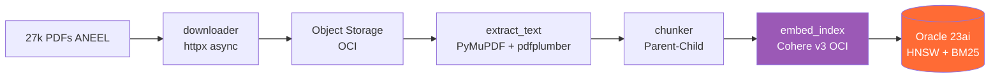
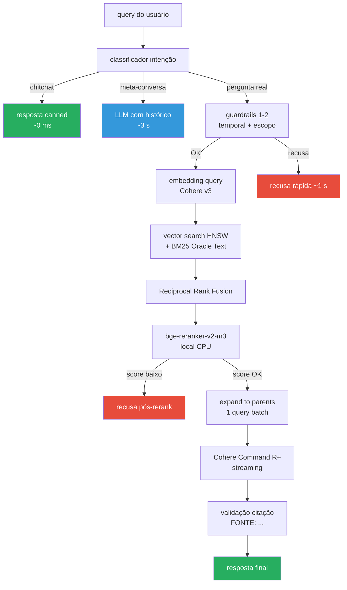

# RAG ANEEL — Agente de Consulta a Legislação do Setor Elétrico

[](https://www.python.org/)
[](LICENSE)
[](https://github.com/Lucas-byte123/RAG-Desafio-ANEEL/actions/workflows/ci.yml)
[](https://137-131-141-27.nip.io/)
[](https://www.oracle.com/database/23ai/)
[](https://cohere.com/)

---

## ⚡ Quickstart (30 segundos, sem credenciais)

```bash
git clone https://github.com/Lucas-byte123/RAG-Desafio-ANEEL.git
cd RAG-Desafio-ANEEL
make smoke              # valida sintaxe + estrutura, sem precisar OCI
```

Ou abra a **[demo ao vivo](https://137-131-141-27.nip.io/)** direto no
navegador — **zero setup**, queries reais sobre 27k PDFs.

📖 **Avaliador**: leia [`AVALIACAO.md`](AVALIACAO.md) (5-30 min, com queries
sugeridas + comandos) | 🐛 **Encontrou bug?** veja [`TROUBLESHOOTING.md`](TROUBLESHOOTING.md)

---

Agente RAG (Retrieval-Augmented Generation) sobre **27.025 PDFs** da legislação da
**ANEEL** (Agência Nacional de Energia Elétrica) — atos publicados ou referenciados em **2015, 2016, 2020, 2021 e 2022**.

> **📅 Cobertura temporal detalhada:** os 3 JSONs originais da ANEEL importados
> são das **publicações** de 2016, 2021 e 2022. Mas alguns desses PDFs são
> **republicações de atos normativos anteriores** (24 de 2015 + 44 de 2020),
> totalizando 5 anos efetivos no corpus. Distribuição real:
> 2015: 24 PDFs · 2016: 6.155 · 2020: 44 · 2021: 9.416 · 2022: 10.919
> (467 sem ano detectável). O guardrail temporal aceita queries sobre
> qualquer um desses 5 anos.

Stack 100% **Oracle Cloud Infrastructure** + componentes open-source onde dá
vantagem técnica.

> **🎯 Para avaliação rápida (sem rodar nada):** acesse a **[demo ao vivo](https://137-131-141-27.nip.io/)** —
> o agente está rodando 24/7 em Oracle Compute até **2026-05-25**. As seções
> "Como rodar" e "Rodar via Docker" abaixo exigem **credenciais OCI próprias**
> (Autonomous DB populado com 250k vetores + chave de OCI Generative AI). Sem
> elas, a UI sobe mas todas as queries retornam erro de conexão. O caminho de
> reprodução completa do pipeline (download de 27k PDFs → extração → embedding)
> leva ~18h de wall-clock e está documentado na seção "Rebuildar o banco do zero".

> **👤 Avaliador?** Leia o **[`AVALIACAO.md`](AVALIACAO.md)** — guia rápido com
> queries sugeridas, métricas, queries-trap pra testar honestidade do agente,
> e limitações conhecidas (transparência).

---

## 📸 Screenshots da aplicação

**Tela inicial** — sugestões clicáveis, status do BGE, sidebar com arquitetura:



**Resposta com fontes** — query "O que é a tarifa branca?" responde com 5
fontes citadas via `[FONTE: REN 733/2016, pg.1]`, confiança 75%, latência ~30s:



**Recusa de off-topic** — query "qual a altura do neymar?" é recusada via
guardrail (camada 5a, rerank early-exit), com mensagem clara sobre escopo:



**Chitchat instantâneo** — "obrigado!" reconhece como conversa, responde em
**0ms** sem chamar pipeline (classificador de intenção):



**Meta-conversa rápida** — "explica melhor" depois de uma pergunta usa só
o histórico, em **3s** (vs 30s do pipeline normal), com badge claro:



**Indicador de progresso por etapas** — durante os ~30s do pipeline, a UI
mostra em qual estágio está (Embedding → Retrieval → Rerank → Expanding →
Generating), reduzindo a sensação de espera:



---

## 🌐 Demo ao vivo

| | |
|---|---|
| **URL** | https://137-131-141-27.nip.io/ |
| **Health** | https://137-131-141-27.nip.io/health |
| **Acesso** | aberto (sem auth — modo demo) |
| **Hospedagem** | Oracle Cloud Compute (E5.Flex sa-saopaulo-1) + Caddy + Let's Encrypt |

Endpoint válido até **2026-05-25** (fim do crédito promocional OCI).

---

## Arquitetura

### Pipeline de ingestão (rodou 1x, ~18h wall-clock)



### Pipeline de runtime (por query)



**Componentes:**

| Camada | Tecnologia |
|---|---|
| Banco vetorial | **Oracle Autonomous Database 23ai** (HNSW, 1024 dim) |
| Busca lexical | **Oracle Text BM25** (CTXSYS.CONTEXT) |
| Embeddings | **Cohere Embed Multilingual v3** via OCI Generative AI |
| Reranking | **bge-reranker-v2-m3** (BAAI, multilíngue, local) |
| LLM | **Cohere Command R+ 08-2024** via OCI Generative AI (streaming) |
| UI | **Streamlit** com chat + fontes citadas |
| Compute | **OCI Compute** (E5.Flex ou A1.Flex Always-Free) |

---

## Métricas (eval suite, 25 queries-gabarito)

Dataset curado em `scripts/eval_dataset.py` com 25 queries em 4 categorias:
**factual** (com `expected_doc_pattern` + `expected_keywords`), **conceitual**,
**off-topic** (deve recusar), **fora-escopo-temporal** (deve recusar).

| Métrica | Valor | Como medida |
|---|---|---|
| Refusal accuracy (off-topic + temporal) | **25/25 = 100%** | recusou todas que deveria |
| Doc match em queries factuais | 6/8 (**75%**) | `expected_doc_pattern` apareceu em alguma fonte citada |
| Reference chunk em top-5 | 4/6 (**67%**) | `reference_chunk_id` no top-5 antes do rerank |
| Keyword recall (factuais) | 48 – 80% | termos esperados apareceram na resposta |
| Latência off-topic (p50) | **~1s** | recusa cedo (camadas 1–2) evita LLM |
| Latência geral (p50) | ~17s | inclui embedding + retrieval + rerank + LLM streaming |
| Citação de fonte | 100% das respostas | regex `[FONTE: ...]` + validação pós-geração |

Reproduzir: `python scripts/eval_runner.py` (~8 min). Resultado bruto em
`inspect/eval_results.json`. Cada query loga via `_logger.py` em
`logs/agent.jsonl` (request_id, refusal_reason, top1_dist, top1_rerank, elapsed_ms).

---

## Como rodar (Oracle ATP já populado)

### Pré-requisitos

- Python **3.11+**
- Oracle Wallet do Autonomous DB descompactado em `.secrets/wallet/`
- Senha do wallet em `.secrets/wallet.pass`
- Config OCI em `~/.oci/config` (rodar `oci setup config`)
- Senha do usuário ADMIN do ATP em variável de ambiente

### Setup

```bash
# 1. Instalar deps
python -m pip install -r requirements.txt

# 2. Configurar variáveis
cp .env.example .env
# editar .env com a senha do DB

# 3. Carregar env (Linux/Mac)
source .env
# OU PowerShell:
# Get-Content .env | ForEach-Object { if ($_ -match '^([^#=]+)=(.*)$') { [Environment]::SetEnvironmentVariable($Matches[1], $Matches[2]) } }
```

### Rodar

```bash
# UI (Streamlit, recomendado)
python -m streamlit run scripts/app_streamlit.py

# CLI interativo
python scripts/rag_agent.py --interactive

# Query única
python scripts/rag_agent.py "Quem preside a Comissão Especial de Licitação?"

# Eval completa (25 queries, ~8 min)
python scripts/eval_runner.py

# Health check (Oracle + OCI GenAI)
python scripts/health_check.py
```

> Para deploy em produção (HTTPS + autenticação + systemd hardening + SELinux),
> ver **[DEPLOY.md](DEPLOY.md)**.

---

## Rodar via Docker (replicabilidade)

Pra avaliar o agente sem instalar Python, torch e baixar 600 MB de bge-reranker
no host, há `Dockerfile` multi-stage + `docker-compose.yml` prontos.

**Pré-requisitos** (mesmas credenciais do modo nativo):

```
.env                    # com DB_ADMIN_PASS preenchido (cp .env.example .env)
.secrets/wallet/        # wallet do Autonomous DB descompactado
.secrets/wallet.pass    # senha do wallet em texto puro
~/.oci/config           # credenciais OCI Generative AI (oci setup config)
```

**Subir:**

```bash
docker compose up --build       # 1ª vez: ~10 min de build (torch CPU + bge cache)
                                # próximas: ~30 s (cache de layers)
```

A imagem é multi-stage: o build pré-baixa o `bge-reranker-v2-m3` dentro da
imagem, então o cold start da primeira query cai de ~3 min para ~5 s.

**Acessar:**

| | |
|---|---|
| UI Streamlit | http://localhost:8501 |
| Health JSON | http://localhost:8502/health |

**O que NÃO entra na imagem** (montado como volume read-only em runtime):

- `.secrets/wallet/`, `.secrets/wallet.pass` — wallet do Oracle ATP
- `~/.oci/config` + chave `.pem` — credenciais OCI GenAI

Tudo o que é segredo fica fora do build context (ver `.dockerignore`).

**Tamanho final:** ~3.5 GB (torch CPU + sentence-transformers + bge cache).
Usar torch CPU-only (não CUDA) economiza ~2 GB e nada disso faz falta —
embedding/LLM rodam via API OCI; só o rerank usa CPU local.

---

## Rebuildar o banco do zero

Em caso de outra pessoa querer reproduzir o pipeline completo (do JSON original
da ANEEL até o agente respondendo). Tempos estimados na **VM Standard E5.Flex
(2 OCPU x86 / 100 GB RAM, Oracle Linux 9)** — a VM Always Free Ampere A1 (4 OCPU
ARM / 24 GB) também roda, mas com tempos diferentes em extração/chunker.

### 0. Provisionar infra OCI (~15 min)

```bash
# 1. Bucket Object Storage
oci os bucket create --name aneel-rag --compartment-id <COMP_OCID>

# 2. Autonomous Database (Always Free, OLTP, 23ai)
# Via Console OCI: criar com workload OLTP, Always Free, password ADMIN forte
# Baixar Wallet → unzip em .secrets/wallet/ → senha em .secrets/wallet.pass

# 3. VM Compute (E5.Flex 2 OCPU / 16 GB ou A1.Flex Always Free 4 OCPU / 24 GB)
# Oracle Linux 9
```

### 1. Construir manifesto (~30 s, local)

```bash
python scripts/build_manifest.py
# Lê biblioteca_aneel_*_metadados.json (3 arquivos: publicações de 2016, 2021, 2022).
# Atos referenciados podem ser de 2015, 2020, 2021 (publicados nesses anos) → corpus efetivo: 5 anos.
# Gera manifest/manifest.parquet com 27.025 PDFs
```

Subir manifesto pro DB (3 tabelas separadas — manifest, extractions, vectors —
permitem re-rodar etapas sem perder estado):

```bash
python scripts/create_chunks_table.py        # cria CHUNKS + MANIFEST
python scripts/create_extractions_table.py   # cria EXTRACTIONS (CLOB do JSON)
python scripts/create_vectors_table.py       # cria CHUNK_VECTORS (VECTOR 1024)
python scripts/upload_to_db.py               # popula MANIFEST com 27.025 linhas
```

### 2. Download dos PDFs (~6h, na VM)

Fazer **na VM Oracle** (não local — ANEEL bloqueia residencial; VM tem IP datacenter).

```bash
ssh opc@<IP-VM>
cd ~/rag-aneel
export DB_ADMIN_PASS=... WALLET_PASS=... OCI_NAMESPACE=...
python scripts/downloader.py
# httpx async, 5 workers, jitter 200-800ms, backoff exponencial
# Resume automático: WHERE status_download != 'success'
# Upload direto pro Object Storage (sem disco)
```

### 3. Extração estrutural (~8h, local com 8 workers)

```bash
python scripts/extract_text.py
# Streaming: baixa do Object Storage → pymupdf em memória → descarta
# Detecta header/footer, hierarquia legal (Cap/Seção/Art/§/Inciso),
# tabelas via pymupdf+pdfplumber, quality_score por PDF
```

Validação rápida:

```bash
python scripts/inspect_extraction.py --sample 10
```

### 4. Chunker Parent-Child (~1h)

```bash
python scripts/chunker.py
# CHILD chunks (~400 tokens) — unidade de busca vetorial
# PARENT chunks (~1200 tokens) — contexto pro LLM
# Artigo é unidade atômica; tabela é chunk único
```

### 5. Embedding (~3h, batches de 96)

```bash
python scripts/embed_index.py
# Cohere Embed Multilingual v3 via OCI Generative AI (sa-saopaulo-1)
# 1024 dim, FLOAT32, input_type=SEARCH_DOCUMENT
# Idempotente: LEFT JOIN não-matched
```

### 6. Índices (~2 min)

```bash
python scripts/build_indexes.py
# HNSW Vector Index sobre chunk_vectors.embedding
# Oracle Text Index sobre chunks.text_embed (BM25)
```

### 7. Verificar e rodar

```bash
python scripts/health_check.py            # snapshot do estado do DB
python scripts/eval_runner.py             # 25 queries-gabarito (~8 min)
python -m streamlit run scripts/app_streamlit.py
```

**Total tempo wall-clock: ~18h** (sendo download e extração os gargalos —
ambos paralelizáveis em mais máquinas).

---

## 5 camadas de guardrails

Cada camada tem `refusal_reason` próprio, registrado em `logs/agent.jsonl` pra
auditoria. A ordem é deliberada: as mais baratas primeiro (regex / keyword), as
mais caras (rerank, LLM judge) por último.

| # | Camada | Sinal | `refusal_reason` |
|---|---|---|---|
| 1 | **Pré: Temporal** | Query menciona ano fora de {2015, 2016, 2020, 2021, 2022} | `fora_escopo_temporal` |
| 2 | **Pré: Escopo temático** | Termos off-topic (futebol, Selic, COVID, política) | `fora_escopo_tematico` |
| 3 | **Pós-retrieval: Vazio** | Vector + BM25 = 0 resultados | `zero_resultados` |
| 4 | **Pós-retrieval: Gap semântico** | top-1 distante E sem cluster até top-10 | `off_topic_provavel` |
| 5a | **Pós-rerank: Early-exit** | bge-reranker score máx < 0.02 | `off_topic_rerank` |
| 5b | **Pós-LLM: Citação ausente** | Resposta gerada sem `[FONTE: ...]` válida | `baixa_confianca` |

**Justificativa de ordem:** filtros de regex (1, 2) custam ~1ms; retrieval (3, 4)
~500ms; rerank (5a) ~200ms; LLM (5b) ~10s. Recusar cedo evita custo desnecessário
de OCI Generative AI.

---

## Estrutura

```
.
├── scripts/
│   ├── build_manifest.py     # JSON ANEEL → manifest.parquet (1 linha por PDF)
│   ├── upload_to_db.py       # Sobe manifest pro Oracle ATP
│   ├── downloader.py         # httpx async + Object Storage (rodar na VM)
│   ├── extract_text.py       # PyMuPDF + pdfplumber (estrutural)
│   ├── chunker.py            # Parent-Child + tabelas preservadas
│   ├── embed_index.py        # Cohere Embed Multilingual v3 via OCI
│   ├── build_indexes.py      # HNSW + Oracle Text BM25
│   ├── rag_agent.py          # Orquestrador (5 camadas, RRF, rerank, streaming)
│   ├── app_streamlit.py      # UI chat
│   ├── health_server.py      # FastAPI /health /ready
│   ├── health_check.py       # Snapshot CLI do Oracle
│   ├── eval_dataset.py       # 25 queries-gabarito curadas
│   ├── eval_runner.py        # Mede refusal/doc_match/kw_recall/latency
│   └── _logger.py            # JSONL structured logger
├── .secrets/                 # Wallet OCI, chaves (gitignored)
├── inspect/                  # Outputs de inspeção e eval
├── manifest/                 # manifest.parquet (gerado)
├── logs/                     # agent.jsonl (gerado, structured)
├── requirements.txt
├── .env.example
├── start.sh                  # Bootstrap (install/run/health/eval)
├── DEPLOY.md                 # Deploy seguro em produção (Caddy + systemd + SELinux)
└── README.md
```

---

## Exemplos em ação

### Query factual respondida

```
> Quem preside a Comissão Especial de Licitação?
```

**Resposta** (extrato):
> A Comissão Especial de Licitação é presidida pelo Diretor-Geral da ANEEL ou
> seu representante designado, conforme [FONTE: REN 1000/2021, Art. 12, § 2º].

Top-3 fontes (após rerank): REN 1000/2021 Art. 12 (rerank=0.94), REN 873/2020
Art. 5 (0.71), Despacho 4321/2022 (0.43). Latência total: 14.2s.

### Query off-topic recusada

```
> Qual o saldo da Selic em 2024?
```

**Resposta** (em ~0.8s, sem chamar LLM):
> Esta consulta está fora do escopo do agente, que cobre apenas legislação
> da ANEEL (anos 2015, 2016, 2020, 2021, 2022). `refusal_reason: fora_escopo_temporal`
> (ano 2024 fora do corpus) + `fora_escopo_tematico` (termo "Selic").

---

## 💰 Plano Oracle Cloud usado e como obter

Este projeto foi construído **inteiramente no Oracle Cloud Free Tier**. Você
consegue replicar o ambiente sem custo (ou com custo mínimo) seguindo o mesmo
caminho.

### O que foi usado

| Recurso | Plano | Custo |
|---|---|---|
| **Autonomous Database 23ai** (banco vetorial + BM25) | Always Free Tier | **R$ 0** perpétuo |
| **VM Compute** E5.Flex 2 OCPU x86 (servidor da demo) | Crédito promocional 30 dias | **R$ 0** durante crédito |
| **VM A1.Flex Always Free** (alternativa ARM, 4 OCPU/24 GB) | Always Free Tier | **R$ 0** perpétuo |
| **Object Storage** (~5 GB pra PDFs ANEEL) | Always Free Tier (até 20 GB) | **R$ 0** perpétuo |
| **OCI Generative AI** (Cohere Embed v3 + Command R+) | On-demand pay-per-use, descontado do crédito | **~R$ 285/mês** após crédito esgotar |
| **Let's Encrypt** (HTTPS automático via Caddy) | Grátis | **R$ 0** |

**Total durante crédito promocional (30 dias):** R$ 0 (cobre folgadamente
desenvolvimento + 30 dias de demo).

**Total após crédito (continuar rodando 24/7):** ~R$ 285/mês com 1k queries/dia,
sendo o grosso (~R$ 280) do Cohere Command R+ output. Migrando pra A1.Flex
Always Free e desligando à noite, fica em ~R$ 50/mês.

### Como o avaliador pega o mesmo plano

> ⚠️ **Importante:** Free Tier requer cartão de crédito válido pra verificação
> (não é cobrado se ficar dentro do limite).

**1. Criar conta:** acesse https://signup.oraclecloud.com/

Você ganha:
- **30 dias** com **R$ 2.500 de crédito promocional** (~US$ 300) pra usar em
  qualquer recurso
- **Always Free Tier** perpétuo após o período promocional, com:
  - 2× Autonomous Database (20 GB cada, 2 OCPU)
  - 1× ARM A1.Flex (até 4 OCPU + 24 GB RAM ou pode dividir em até 4 VMs)
  - 2× AMD VM Compute (1/8 OCPU + 1 GB RAM cada — pequenas)
  - 200 GB Block Storage
  - 20 GB Object Storage
  - 10 TB de saída de rede/mês
  - Lista completa: https://www.oracle.com/cloud/free/

**2. Provisionar Autonomous Database 23ai:**
- Console OCI → Oracle Database → Autonomous Database → Create
- Workload type: **Transaction Processing**
- Marque **Always Free**
- Database version: **23ai**
- Defina senha do ADMIN forte
- Após provisionado, baixe o **Wallet** e a senha (vai pra `.secrets/wallet/`)

**3. Provisionar VM Compute:**
- Console OCI → Compute → Instances → Create
- Shape: **VM.Standard.A1.Flex** (ARM Always Free, recomendado)
- OS: **Oracle Linux 9**
- 4 OCPU / 24 GB RAM
- Salve a chave SSH

**4. Habilitar OCI Generative AI:**
- Console OCI → Generative AI → Models
- Confirma que `Cohere Embed Multilingual v3` e `Cohere Command R+ 08-2024`
  aparecem como `ACTIVE`
- Disponível em: `sa-saopaulo-1`, `us-chicago-1`, `eu-frankfurt-1`,
  `uk-london-1`

**5. Configurar OCI CLI local:**
```bash
oci setup config
# segue prompts: tenancy OCID, user OCID, RSA key, região
```

**6. Continuar:** ver [`README.md`](README.md) seção "Como rodar (Oracle ATP
já populado)" se quiser pular a ingestão (impossível sem ter o seed dataset),
ou seção "Rebuildar o banco do zero" pra rodar pipeline completo (~18h
wall-clock).

### Observação: a demo pública

A URL https://137-131-141-27.nip.io/ está hospedada na **VM E5.Flex**
(não Always Free) durante o crédito promocional. Após **2026-05-25** o
crédito esgota e a URL pode ficar offline. Pra avaliação após essa data,
clone o repo e suba seu próprio Free Tier.

### Detalhamento de custo (após crédito esgotar)

| Item | Modelo de cobrança | Custo mensal aprox. |
|---|---|---|
| Autonomous DB 23ai (Always Free) | grátis até 20 GB / 2 OCPU | **R$ 0** |
| VM Compute (E5.Flex 2 OCPU) | $0.025/h × 720h | **~R$ 90** |
| VM A1.Flex Always Free (alternativa) | grátis até 4 OCPU / 24 GB | **R$ 0** |
| Object Storage (~5 GB) | $0.0255/GB-mês | **~R$ 0,65** |
| Cohere Embed Multilingual v3 | $0.10 / 1M tokens | **~R$ 5** (1k queries/dia) |
| Cohere Command R+ 08-2024 | $2.50 / 1M input + $10 / 1M output | **~R$ 280** (1k queries/dia, ~3k tokens/resposta) |
| Let's Encrypt cert | grátis | **R$ 0** |
| **Total mensal estimado** | | **~R$ 375** (E5) ou **~R$ 285** (A1 free) |

**Embedding em massa** (one-time): ~250.000 chunks × 400 tokens = 100M tokens ×
$0.10/M = **~R$ 50** uma vez só.

---

## Decisões técnicas notáveis

- **Parent-Child retrieval**: chunks de ~400 tokens pra busca, parents de ~1200 tokens pro LLM.
- **RRF (Reciprocal Rank Fusion)** combina vector + BM25 sem viés de escala.
- **bge-reranker local** em vez de Cohere Rerank: a região São Paulo do OCI não tem on-demand serving pra Rerank (só Dedicated Cluster ~US$5/h).
- **HyDE opt-in**: ganho marginal de qualidade, custo alto de latência (+3s).
- **Cache LRU de embeddings**: queries repetidas economizam ~500ms cada.
- **bge warm-up em background thread**: não bloqueia o startup do agente.
